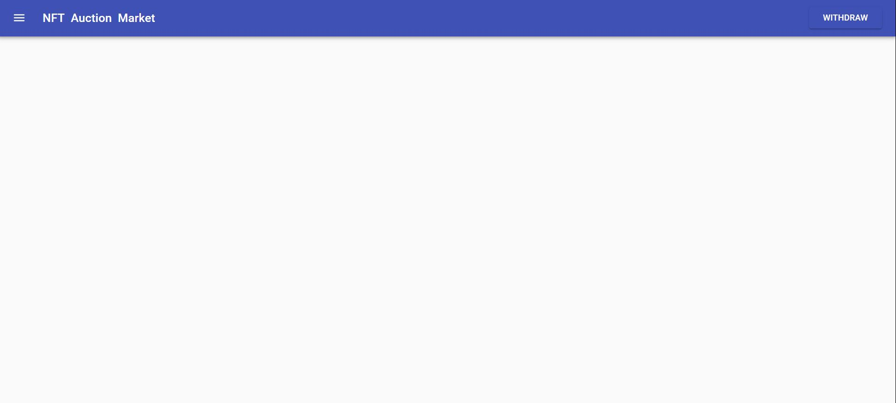
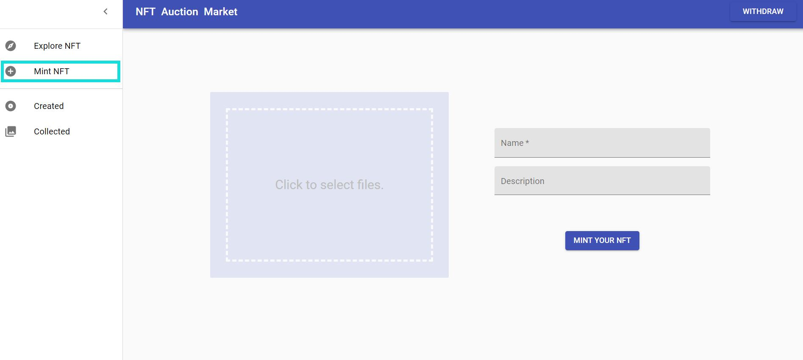
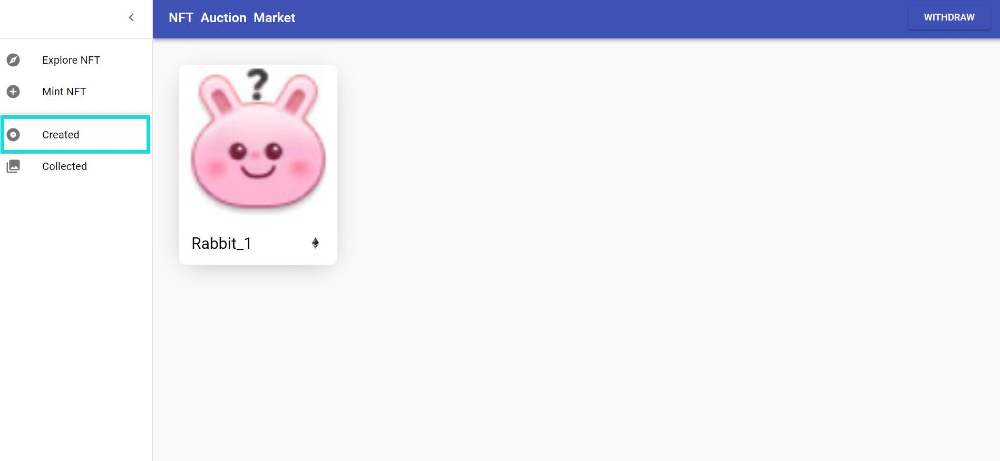
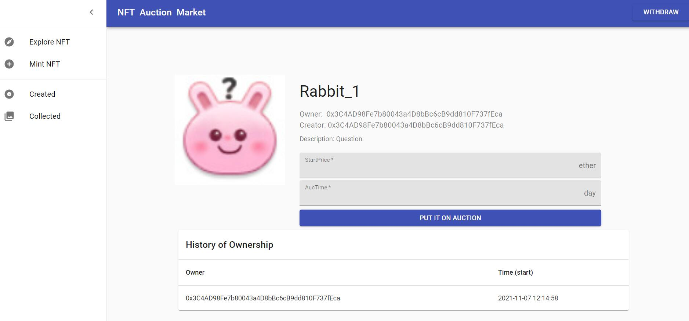
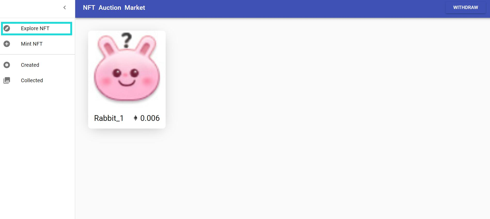

# NFT-Auction-Market
## :framed_picture: Preview
Check out how it looks:



You can mint your NFT:



You can see the NFT you created: 



You can put the NFT for auction: 



You can explore all the NFT on auction:



Also, you can see the NFT you collected through auction on the page "collected".

If you are a bidder, you can bid for NFT, withdraw your money if there is a higher bid price, and as well as claim the NFT if you are the winner.
For the case when no one bid for NFT, the owner can fetch the NFT after the auction.

All the information about the history of ownership of NFTs and the history of bids of auctions is displayed.


## :gear: Built With
This project was developed with the following technologies:

#### Frontend <sup>React + JavaScript<sup>
- React
- Redux
- Web3.js
- Material UI
- IPFS API

#### Blockchain and Contracts <sup>Solidity<sup>
- Solidity
- Truffle
- Ganache
- MetaMask
  
## :joystick: how to use
#### Requirements
To run the application you'll need:
- Git
- Node
- Yarn or npm
- Truffle
- Ganache
- Metamask
- IPFS

#### Steps
1. Clone the repository
2. Go to the project folder
``` bash
$ cd NFT-Auction-Market-main
```
3. install the dependencies
``` bash
$ yarn
```
  **If you are using the code file I emailed to TA, you will need to install @openzeppelin/contracts additionally.**
```bash
$ npm install @openzeppelin/contracts
```
4. Run the ganache and MetaMask. Make sure they use port 7545.
5. Migrate and deploy the contracts
``` bash
$ truffle migrate
```
6. Run the ipfs. Make sure you have ipfs configured for cross-domain resource sharing.
7. Run the client
``` bash
$ cd client
$ npm install
$ yarn start
```
  
  

